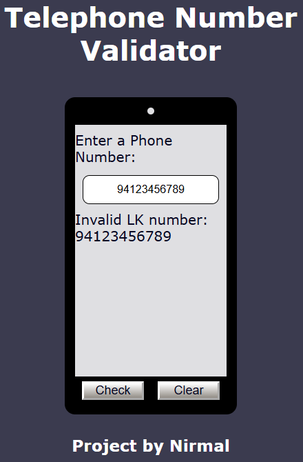
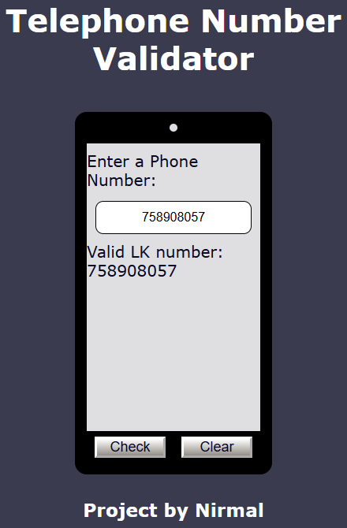

# Telephone Number Validator

This project is a web-based application designed to validate telephone numbers, specifically Sri Lankan (LK) phone numbers, based on various predefined formats. Users can input a phone number, check its validity, and clear the input field.

---

## Features

- **Real-Time Validation**:
  - Checks if the entered number matches predefined Sri Lankan phone number formats.
- **Interactive UI**:
  - A clean, phone-like interface with styled input and result display.
- **Customizable Styles**:
  - Easily adaptable design via the provided CSS.
- **Supported Phone Number Formats**:
  - `94 7X-XXX-XXXX` or `7X-XXX-XXXX`
  - `94 (7X) XXX-XXXX` or `(7X) XXX-XXXX`
  - `94(7X)XXX-XXXX` or `(7X)XXX-XXXX`
  - `94 7X XXX XXXX` or `7X XXX XXXX`
  - Simple 9-digit format starting with `7` (`7XXXXXXXX`)
  - With or without the country code (`94`).

---

## How It Works

1. **Enter a Phone Number**:
   - Type a phone number into the input field.
   - Click the **Check** button to validate the number.

2. **Validation Results**:
   - If valid, the result displays as: `Valid LK number: [Phone Number]`.
   - If invalid, the result displays as: `Invalid LK number: [Phone Number]`.

3. **Clear Input**:
   - Click the **Clear** button to reset the input field and clear the results.

---

### JavaScript (`script.js`)

- Implements the following:
  - **Validation Logic**: Uses regular expressions to check if a number matches one of the valid formats.
  - **Event Handling**:
    - Button click events for **Check** and **Clear** actions.
  - **Reusable Functions**:
    - `isValidPhoneNumber(phoneNumber)`: Core logic for phone number validation.

---

## How to Run

1. Clone the repository or copy the project files.
2. Open the `index.html` file in any modern web browser.
3. Enter a phone number in the input field and test the functionality.

---

## Screenshot

Below is an example of the  telephone number validator in action:

    
    

